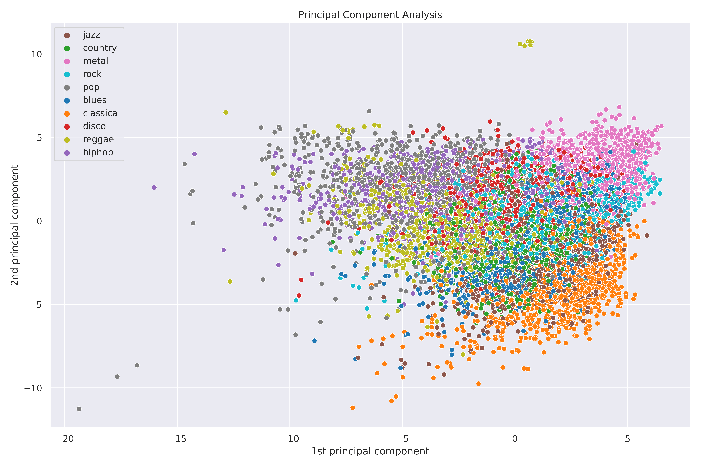
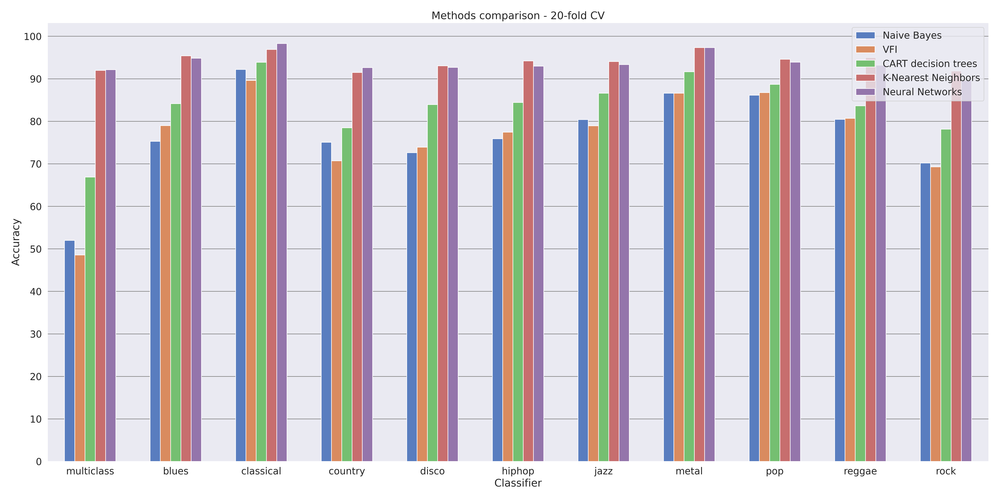

# Numerical Analysis for Machine Learning - Project

## ML for automatic musical genre classification
This project aims to study the feasibility of building systems for the automatic classification of musical genres, through the use of Machine Learning.
The analysis was conducted using the [GTZAN dataset](https://www.kaggle.com/datasets/andradaolteanu/gtzan-dataset-music-genre-classification).
Starting from an audio track, the goal is to be able to automatically assign it to one of the 10 musical genres present in the dataset.
This work relies on the Python programming language, and in particular mostly on the libraries [scikit-learn](https://scikit-learn.org/stable/index.html) and [keras](https://keras.io).

In the analysis, the following ML and DL models were considered:
- Gaussian Naive Bayes
- Voting Feature Intervals
- CART Decision Trees
- K-Nearest Neighbors
- Fully-connected Neural Networks

A comparison of all those models is presented in the last chapter of the report.
                                        
During the project, it was discovered that the problem at hand is fairly complex due to the ambiguity inherent to every definition of musical genre.
Nonetheless, the results obtained are very encouraging since multiple modes were able to reach high accuracy on unseen data.   

It is possible to conclude that building systems for automatic musical genre classification is certainly possible and that analyzing simple musical features extracted from an audio track is enough to reach a high level of accuracy.

The final report of the project is available [here](report/report.pdf).
        

## Setup
Install all the required Python packages with:

    pip install -r requirements.txt

The project was developed using:
- Python 3.8.10
- Tensorflow 2.11.0
- CUDA® Toolkit 11.8
- cuDNN SDK 8.6.0
            

## Exploratory Data Analysis
The first step was an exploratory data analysis (EDA) of the information contained in the dataset.
The [GTZAN dataset](https://www.kaggle.com/datasets/andradaolteanu/gtzan-dataset-music-genre-classification) consists of a collection of 10 genres (blues, classical, country, disco, hip-hop, jazz, metal, pop, reggae and rock) with 100 audio files each, all having a length of 30 seconds.
In this analysis, the file `features_3_sec.csv` available in the dataset was considered.

The correlation of the input features w.r.t. the target variable was computed using the [Predictive Power Score](https://github.com/8080labs/ppscore/tree/1.1.2).

To visualize the data and understand its structure, Principal Component Analysis (PCA) was used, computed through Singular Value Decomposition (SVD).
The following chart shows a scatter plot of the first two principal components of the samples in the dataset.

## ML models
For each one of the Machine Learning models considered, a multi-class classification model and 10 binary classification models were trained and evaluated.
Every model was considered in a separate notebook.
Model evaluation was performed through static partitioning (train-validation split) and dynamic partitioning (k-fold cross-validation).
             

## DL model
In the last step of the project, a DL model was considered: fully-connected Neural Networks.

Given the large number of hyper-parameters to tune and the large amount of time required to train such a model, the results of each training phase were stored in the persistent database [MongoDB](https://www.mongodb.com), together with the combination of the hyper-parameters that produced them.
This was in order to easily filter and aggregate those results.

Then, also this model was evaluated using static partitioning and dynamic partitioning, to allow for a fair comparison with ML models.
         
## Performance comparison
The following chart shows a comparison of the accuracy of all the models considered in the project, both in the multi-class case and in the binary cases. The results were produced by evaluating all the models using 20-fold cross-validation.

## Software
- [Scikit-learn](https://scikit-learn.org/stable/index.html)
- [Keras](https://keras.io)
- [Predictive Power Score](https://github.com/8080labs/ppscore/tree/1.1.2)
- [Voting Feature Intervals](https://github.com/chkoar/vfi)
- [MongoDB](https://www.mongodb.com)
- [Overleaf](https://www.overleaf.com/)
- [Python](https://www.python.org/)
- [PyCharm](https://www.jetbrains.com/pycharm/)
- [JupyterLab](http://jupyterlab.github.io/jupyterlab/)
       

## License
Licensed under [MIT License](LICENSE)
